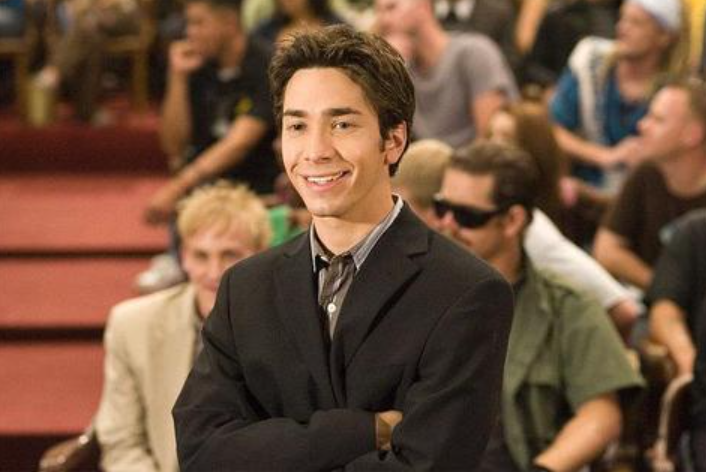

 
<h4>"A real university requires stone walls, centuries of tradition, and strict gatekeepers to decree who is worthy and who is a failure. Without rejection, education means absolutely nothing."</h4>

<h4>"You say we aren't a real college? Why? Because we don't have a multi-million dollar stadium? You don't need buildings to learn! You need a desire to improve yourself, and that’s exactly what happens on our campus every single day!"</h4>

<h4>"If we accept everyone, how do we rank them? How do we produce standardized units for the corporate market? Passion is chaotic; algorithms are safe."</h4>

<h4>"We are a community of rejects, but we refuse to let your rejection slips define our worth. You ask who gave us the authority to open a university? 
Who decides our future? WE DO! S.H.I.T. doesn't accept people to sit them in boring lecture halls; we accept people to let them find out who they truly want to be!"
</h4>
           
            
